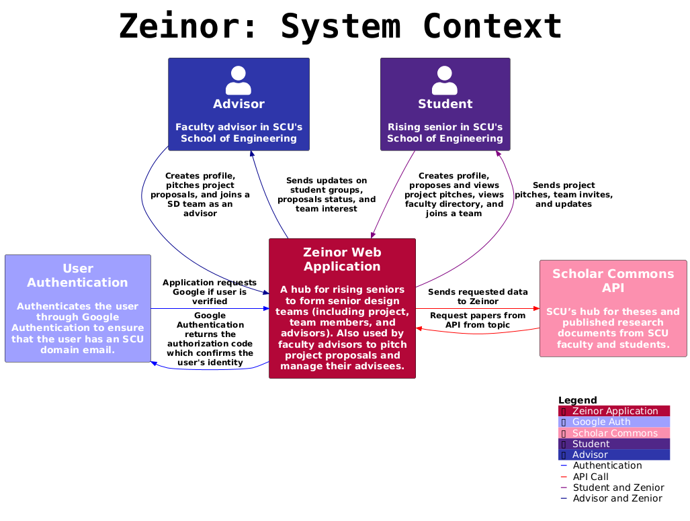
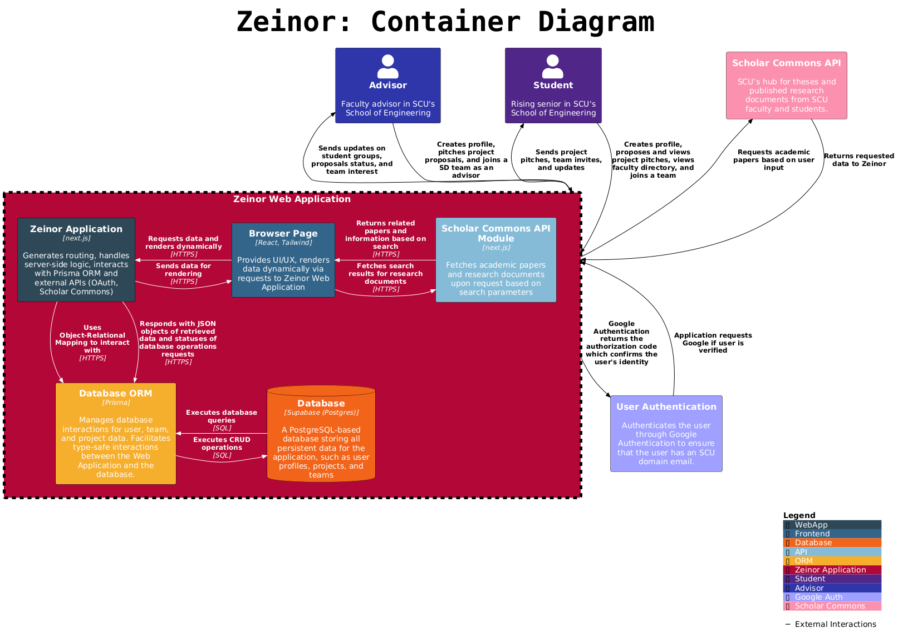

<p align="center">
  
</p>

<p align="center" style="font-size: 36px;">
  <em> Zenior: A Next-Generation Platform for Engineering Students and Faculty Collaboration</em>
</p>

<p align="center">
    <a href="https://github.com/CSEN-SCU/csen-174-f24-project-zenior/releases" alt="Pre-release">
        
    </a>
    <a href="https://github.com/CSEN-SCU/csen-174-f24-project-zenior/blob/main/LICENSE" alt="License Badge">
        
    </a>
    <a href="https://github.com/CSEN-SCU/csen-174-f24-project-zenior/commits" alt="Last Commit">
        
    </a>
    <a href="https://github.com/CSEN-SCU/csen-174-f24-project-zenior/graphs/contributors" alt="Contributors">
        
    </a>
</p>

<p align="center">
    
    
</p>

## 🌐 About

Zeinor is a comprehensive platform for rising juniors in the School of Engineering, designed to facilitate their preparation for senior design projects. It offers tools for students to explore and plan their projects efficiently for the upcoming year. Additionally, the platform enables faculty members to submit research topics and project opportunities that students can collaborate on, fostering a dynamic and collaborative environment for academic development and innovation.

### 🛠️ Features

- ⚡ **Project Planning and Exploration**: Assists juniors in the School of Engineering to discover and organize their senior design projects efficiently.
- ✨ **Faculty Collaboration**: Faculty members can submit research topics and project ideas, making it easy for students to connect with real-world opportunities.
- 📈 **Track Progress**: Monitor the progress of projects with updates for both students and faculty.
- 💼 **Resource Management**: Access and manage resources such as research papers, tools, and mentorship opportunities provided by faculty.
- 🔍 **Search and Discover**: Easily browse through available projects and faculty-submitted opportunities, enhancing student-faculty interactions and project discovery.

## 📑 Table of Contents

<details>
  <summary>🚀 <strong>Get Started</strong></summary>
  
  - [Environment Setup](#environment-setup)
  - [Install Dependencies](#install-dependencies)
  - [Generate Prisma Client](#generate-prisma-client)
  - [Run the Development Server](#run-the-development-server)
  - [Run Prisma Studio](#run-prisma-studio)
  - [Learn More](#learn-more)
  - [PlantUML for Diagrams](#plantuml-for-diagrams)
  
</details>

<details>
  <summary>📊 <strong>Diagrams</strong></summary>
  
  - [C4 Diagrams](#c4-diagrams)
    - [System Context Diagram](#system-context-diagram)
    - [Container Diagram](#container-diagram)
  - [Database Diagrams](#database-diagrams)
    - [Database Schema](#database-schema)
  
</details>

<details>
  <summary>📜 <strong>License</strong></summary>
  
  - [License](#license)
  
</details>

## 🚀 Get Started

<details>
  <summary><strong>🔧 Environment Setup</strong></summary>

Get the `.env` file from the project Google Drive and place it in the root of the project (next to `package.json`).

</details>

<details>
  <summary><strong>📦 Install Dependencies</strong></summary>

```bash
npm install
```

</details>

<details>
  <summary><strong>🔄 Generate Prisma Client</strong></summary>

```bash
npx prisma generate
```

</details>

<details>
  <summary><strong>🚀 Run the Development Server</strong></summary>

```bash
npm run dev
```

Open [http://localhost:3000](http://localhost:3000) with your browser to see the result.

</details>

<details>
  <summary><strong>🛠️ Run Prisma Studio</strong></summary>

(Optional) Run Prisma Studio to visually work with the database:

```bash
npx prisma studio
```

</details>

<details>
  <summary><strong>💡 Learn More</strong></summary>

To learn more about the technology used in this project, take a look at the following resources:

- [Next.js Documentation](https://nextjs.org/docs) - Learn about Next.js features and API.
- [Learn Next.js](https://nextjs.org/learn) - An interactive Next.js tutorial.
- [React Docs](https://react.dev/) - React documentation with examples and references.
- [Tailwind CSS Documentation](https://tailwindcss.com/docs) - Learn how to use Tailwind utility classes.
- [Prisma Documentation](https://www.prisma.io/docs/orm) - Learn about Prisma ORM.
- [Shadcn/ui Documentation](https://ui.shadcn.com/docs) - Learn about Shadcn/ui components and examples.

</details>

<details>
    <summary><strong>🚀 Technology Choices Explained</strong></summary>

- **React** - React is a JavaScript library for building user interfaces.
  It is backed by a large company and maintained a community of individual developers, making it
  both reliable and open, with a large number of libraries and tools available.
  Compared to Vue, Angular, and Svelte (other popular frontend frameworks), React is the most
  popular and has the most libraries and packages avaliable. It's also the most widely used
  frontend framework in the industry, making it a great skill to learn.
- **Next.js** - Next.js is a React framework that provides a solution for server-side rendering,
  static site generation, and more. It's backed by Vercel, a company that provides hosting and
  ecosystem for React and Next.js.
- **Prisma** - Prisma is a modern database toolkit that makes it easy to work with databases.
  It provides an ORM (Object-Relational Mapping) that allows you to interact with the database
  using JavaScript objects. It also provides a schema migration tool that allows you to easily
  update the database schema. Prisma is a great choice for this project because it provides a
  simple and easy-to-use API for working with databases and a studio web client to visually
  interact wit hthe database without the need to share Supabase accounts and credentials.
- **Supabase** - Supabase is an open-source alternative to Firebase that provides a suite of
  tools for building web applications. It includes a database, authentication, and storage
  services, as well as a real-time subscription service. Supabase is a great choice for this
  project because it is free and open source, which doesn't tie us to a proprietary platform
  and allows us to host the database ourselves if we decide to. Compared to Firebase, Supabase
  is more open and flexible, and it provides a more modern and developer-friendly API that
  integrates with Prisma and allows us to easily switch database providers.
- **Tailwind CSS** - Tailwind CSS is a utility-first CSS framework that provides a set of
  utility classes that can be used to style HTML elements. It is a great choice for this project
  because it allows us to quickly style the UI without writing custom CSS. It also provides a
  consistent and maintainable way to style the UI, making it easy to update and modify the
  styles as needed. Compared to other CSS frameworks like Bootstrap and Material-UI, Tailwind CSS
  is more flexible and customizable, allowing us to create a unique and modern design for the
  project that doesn't look like a generic template.
- **Shadcn/ui** - Shadcn/ui is a React component library that provides a set of reusable UI
  components that can be used to build web applications. It is a great choice for this project
  because it provides a set of modern and responsive components that can be easily customized
  and styled using Tailwind CSS. It also provides a consistent and cohesive design for the
  project, making it easy to create a professional and polished UI. Compared to other component
  libraries like Material-UI and Ant Design, Shadcn/ui is more lightweight and flexible, allowing
  us to easily integrate it with Tailwind CSS and customize the components to fit the design of
  the project. It also gives us the access to the source code of the used components, which
  allows us to change and modify them as needed, to achive a unique design for the project.

</details>

<details>
  <summary><strong>🍃 PlantUML for Diagrams</strong></summary>

The "diagrams" folder will be to hold diagrams that may change over time. Check out [PlantUML](https://plantuml.com/).  
 You can generate the images directly with the VS Code extension called "PlantUML." Go to settings and find Plantuml: Server and make sure it is set to "https://www.plantuml.com/plantuml",
also ensure that **PlantUML: Render** is set to **PlantUML Server**. To do this, go to settings, search for **PlantUML: Render**, and choose **PlantUML Server** from the dropdown.
You need also need **Java** installed on your system for PlantUML to work.

To preview a diagram, use the command palette (`Ctrl + Shift + P` or `Cmd + Shift + P` on Mac), type **"PlantUML: Preview Current Diagram"**, and select it.  
 To save a diagram as an image, use **"PlantUML: Save Current Diagram As..."** and choose the image format you prefer.

Here, to ensure all generated diagrams are saved in the correct location, set **PlantUML: Export Out Dir** in VS Code settings to `./diagrams/images`. This will automatically save all exported images to the `diagrams/images` folder, keeping them organized.

Optional, but to set the Diagrams Root, go to settings, search for **PlantUML: Diagrams Root**, and set it to the folder where you store your diagrams (e.g., `./diagrams`).

To create C4 model diagrams, you can use the [C4-PlantUML library](https://github.com/plantuml-stdlib/C4-PlantUML). Clone or download the repository, and include it in your diagram with `!includeC4_Container.puml` to access the C4 elements. In this repository, we use the always up-to-date version of the C4-PlantUML library directly from GitHub. To use it in your PlantUML diagrams, simply include the following line at the top of your `.puml` file: `!include https://raw.githubusercontent.com/plantuml-stdlib/C4-PlantUML/master/C4_Container.puml`. This ensures that you always have the latest version of the library without needing to manage any files locally.

</details>

## 📊 Diagrams

### C4 Diagrams

<details>
  <summary><strong>🗺️ System Context Diagram</strong></summary>


_The system context diagram provides a high-level view of the components and their interactions within Zeinor._

</details>

<details>
  <summary><strong>🏗️ Container Diagram</strong></summary>


_This diagram shows the container-level view of the Zeinor application._

</details>

### Database Diagrams

<details>
  <summary><strong>🗄️ Database Schema</strong></summary>


_The database schema diagram illustrates the structure of the SQL database used by Zeinor._

</details>

## 📜 License

This project is licensed under the GPLv3 License. See the [LICENSE](./LICENSE) file for details.
